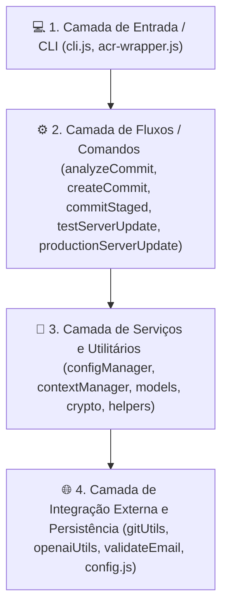
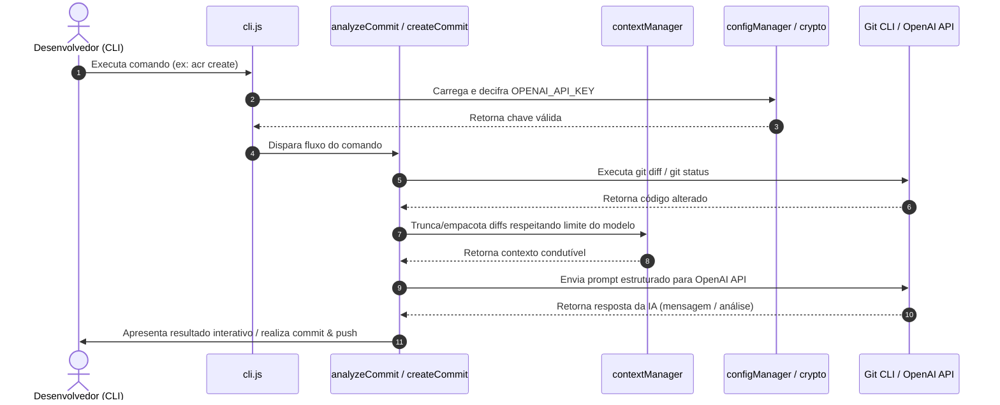

# 🏛️ Arquitetura do Sistema: `ai-commit-review`

## 📌 Visão Geral da Arquitetura

O **`ai-commit-review`** é uma ferramenta de linha de comando (CLI) baseada em Node.js desenvolvida sob o padrão **ES Modules (ESM)** e empacotada via **Webpack** em um bundle único CommonJS executável (`dist/bundle.cjs`) com alias global `acr`.

O sistema tem como objetivo automatizar o fluxo de trabalho no Git, auxiliando desenvolvedores na análise de revisões de código (Code Review), na geração automatizada de mensagens de commit com Inteligência Artificial (OpenAI), no gerenciamento de releases de teste/produção e no envio de relatórios e notificações.

---

## 🏗️ Visão em Camadas (Layered Architecture)

A aplicação está organizada em 4 camadas funcionais desacopladas:



### 1. Camada de Entrada e CLI (`cli.js`, `src/acr-wrapper.js`)
- **Responsabilidade**: Parsing de argumentos do terminal via `commander`, construção de menus interativos com `inquirer`, gerenciamento de atualizações e roteamento de comandos.
- **Entradas**: Comandos do usuário (`acr analyze`, `acr create`, `acr commit`, `acr updateTestServer`, `acr updateProductionServer`, `acr set_config`, `acr crypto`, `acr resetConfig`, `acr help`).

### 2. Camada de Fluxos de Trabalho / Comandos Principais (`src/*Commit*.js`, `src/*Update*.js`)
- **Responsabilidade**: Orquestração das regras de negócio dos casos de uso interativos de terminal.
- **Módulos**:
  - [`src/analyzeCommit.js`](file:///d:/GitHub/ai_commit_review/src/analyzeCommit.js): Seleção paginada de commits e disparo de análise profunda de código com IA.
  - [`src/createCommit.js`](file:///d:/GitHub/ai_commit_review/src/createCommit.js): Criação interativa de commits com staging de todas as alterações, geração de mensagem via IA e push.
  - [`src/commitStaged.js`](file:///d:/GitHub/ai_commit_review/src/commitStaged.js): Commit direto de alterações previamente colocadas em staging (`staged`) com IA.
  - [`src/testServerUpdate.js`](file:///d:/GitHub/ai_commit_review/src/testServerUpdate.js): Automação de verificação de versão Docker, merge para a branch de testes (`teste`) e deploy.
  - [`src/productionServerUpdate.js`](file:///d:/GitHub/ai_commit_review/src/productionServerUpdate.js): Automação de verificação de sanidade, merge de release e abertura de PR para produção (`master`) via GitHub CLI (`gh`).

### 3. Camada de Serviços e Gerenciamento (`src/configManager.js`, `src/contextManager.js`, `src/crypto.js`, `src/models.js`)
- **Responsabilidade**: Validação de credenciais, gestão de chaves de API, criptografia AES-256-CBC, cálculo de limite de contexto de janela de tokens, sumarização em cascata e constantes tipadas.

### 4. Camada de Integração Externa e Persistência (`src/gitUtils.js`, `src/openaiUtils.js`, `src/validateEmail.js`, `src/config.js`)
- **Responsabilidade**:
  - **Git CLI & GitHub CLI**: Execução de comandos do sistema operacional.
  - **OpenAI API**: Chamada aos modelos LLM (ex: `gpt-5-nano`, `openai/gpt-oss-20b`, local).
  - **Nodemailer / SMTP**: Envio de e-mails de validação de código OTP.
  - **Persistência Local**: Leitura e escrita no arquivo de configuração do usuário (`~/.ai-commit-review/.config.json`).

---

## 🔄 Fluxo de Dados Ponta a Ponta (End-to-End)



---

## 🔗 Contrato de Tratamento de Exceções Centralizado

Para respeitar as diretrizes de governança e evitar o encerramento abrupto ou vazamento de *stack traces* brutas para o usuário final:

1. **Relançamento de Erros nas Camadas Inferiores**:
   - Funções utilitárias e serviços (`gitUtils.js`, `openaiUtils.js`, `configManager.js`) **não devem invocar `process.exit()` diretamente**. Elas devem capturar falhas de I/O, rede ou subprocessos e relançá-las (`throw new Error("Mensagem amigável")`).
2. **Tratamento Centralizado no Ponto de Entrada (`cli.js`)**:
   - O ponto de entrada `cli.js` engloba a execução dos comandos em um bloco `try...catch` mestre:
   ```javascript
   try {
     await program.parseAsync(process.argv);
   } catch (error) {
     console.error(chalk.red("❌ Erro durante a execução do comando:"), error.message);
     process.exit(1);
   }
   ```

---

## 📄 Formato Canônico de Respostas da API e Prompts

A comunicação com a API da OpenAI segue contratos estritos de saída conforme o tipo de solicitação (`PromptType`):

### 1. Tipo `CREATE` (Geração de Título e Mensagem de Commit)
- **Estrutura de Resposta Esperada**:
  ```text
  [Emoji] [Título imperativo conciso até 50 caracteres]
  
  [Descrição detalhada das alterações em tópicos]
  
  Motivation and Context:
  [Justificativa do motivo da alteração]
  
  Project Impact:
  [Impacto esperado no sistema]
  ```

### 2. Tipo `ANALYZE` (Revisão de Código / Code Review)
- **Estrutura de Resposta Esperada**:
  ```text
  File: [Nome do Arquivo]
  1. Detailed Summary of Modifications
  2. Identification of Errors, Potential Bugs, and Vulnerabilities
  3. Improvement and Optimization Suggestions (with justifications)
  4. Best Practices and Code Quality Recommendations
  ```
