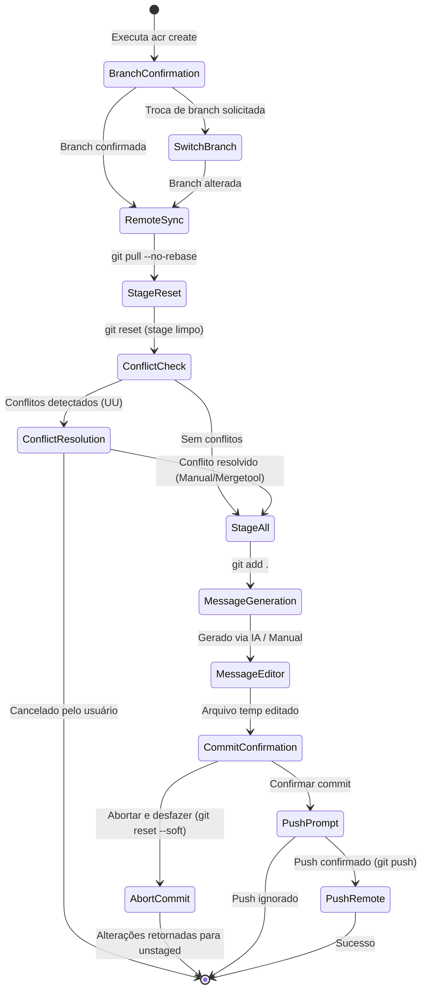
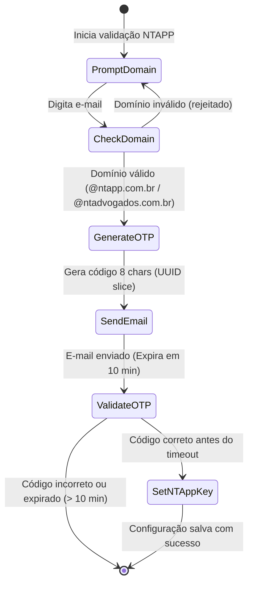
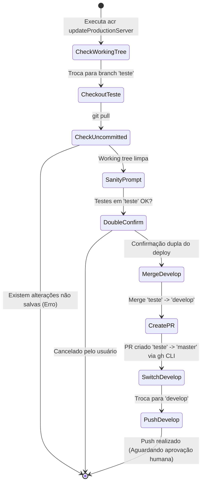

# 📖 Glossário de Domínio e Linguagem Ubíqua (`GLOSSARY.md`)

Este documento formaliza o Dicionário de Domínio e a Linguagem Ubíqua do sistema **`ai-commit-review`**, estabelecido segundo os princípios de **Domain-Driven Design (DDD)**. Ele serve como referência canônica para desenvolvedores, arquitetos e agentes de IA para garantir a consistência conceitual em todo o código-fonte e documentação.

---

## 🏛️ 1. Termos e Entidades Fundamentais

| Termo Canônico | Nome no Código (Model / Entidade / Variable) | Definição Estrita | Sinônimos / O que NÃO é |
| :--- | :--- | :--- | :--- |
| **Commit Analysis** | `analyzeCommits`, `PromptType.ANALYZE` | Fluxo de inspeção detalhada de alterações de código (diffs) por um modelo LLM, atuando como Senior Code Reviewer para identificar bugs, vulnerabilidades e propor melhorias. | **NÃO É** a geração da mensagem de commit. É uma auditoria técnica de qualidade. |
| **Commit Creation** | `createCommit`, `PromptType.CREATE` | Fluxo de staging automatizado de alterações não salvas, geração de mensagem estruturada com IA (título + corpo), edição interativa no terminal e push remoto. | **NÃO É** uma simples execução de `git commit -m`. Envolve verificação de conflitos, staging e sincronização. |
| **Staged Commit** | `commitStaged` | Fluxo de commit focado exclusivamente nos arquivos que já se encontram no Staging Area do Git (`git diff --cached`). | **NÃO É** a criação de commit com `git add .` automático. Respeita o staging prévio do dev. |
| **Context Window / Limite de Contexto** | `ModelContextLimits`, `contextManager` | Limite máximo de tokens que o modelo LLM selecionado suporta processar em uma única requisição. | **NÃO É** o número de linhas do arquivo. É uma métrica de janela de atenção medida em tokens. |
| **Diff Chunking** | `chunkText`, `buildContextForFiles` | Processo de particionamento de diffs extensos em blocos menores (chunks) calculados com base na razão caracter-token para evitar estourar a janela do modelo. | **NÃO É** o truncamento do arquivo com perda de histórico; é uma divisão estruturada para sumarização. |
| **Context Cache** | `CACHE_FILE` (`.cache/context.json`) | Armazenamento temporário dos resumos de diffs indexados por chave hash MD5 (`filename:md5(diff)`), evitando re-chamadas custosas à API OpenAI para diffs inalterados. | **NÃO É** o arquivo de configuração do usuário (`.config.json`). |
| **NTAPP Client** | `isNTapp`, `configByNTAPPEmail` | Tipo de cliente/usuário corporativo autenticado via e-mail corporativo (`@ntapp.com.br` ou `@ntadvogados.com.br`) elegível para recepção de chaves padrão NTAPP. | **NÃO É** um usuário anônimo ou cliente com chave própria OpenAI. |
| **Validation Code (OTP)** | `codigoMap`, `gerarCodigo` | Código alfanumérico único de 8 caracteres derivado do UUIDv4 enviado por e-mail para validação de identidade com expiração em 10 minutos. | **NÃO É** a API Key da OpenAI. É um token de uso único para verificação de e-mail. |
| **Local AI** | `configBaseUrlLocal`, `DEEPSEEK_LOCAL` | Execução do modelo LLM em servidor local (ex: LM Studio / Ollama) mapeado na URL `http://127.0.0.1:1234/v1`. | **NÃO É** a API comercial na nuvem da OpenAI (`api.openai.com`). |
| **Pull Request Release** | `createPullRequest`, `updateServerToProduction` | Solicitação automatizada de merge via GitHub CLI (`gh`) da branch de testes (`teste`) para a branch de produção (`master`). | **NÃO É** um merge direto para a `master`. Requer obrigatoriamente revisão manual. |

---

## 🔄 2. Máquinas de Estado e Ciclos de Vida

### 2.1 Ciclo de Vida do Fluxo de Criação de Commit (`createCommit`)

**Regras de Bloqueio e Transições Proibidas:**
- **Bloqueio de Staging Nulo**: É proibido prosseguir para a geração de mensagem de IA se a lista de diffs em staging estiver vazia (`stagedFiles.length === 0`).
- **Bloqueio de Conflito**: É proibido realizar o commit sem a resolução prévia de todos os arquivos em estado de conflito (`checkConflicts()`).
- **Bloqueio de Mensagem Vazia**: Commit com mensagem em branco é rejeitado antes da finalização.

---

### 2.2 Ciclo de Vida da Validação de Autenticação NTAPP (`validateEmail`)

---

### 2.3 Ciclo de Vida do Release de Produção (`updateServerToProduction`)

**Regras de Bloqueio:**
- **Proibição de Merge com Uncommitted Changes**: O deploy é cancelado imediatamente se houver alterações não commitadas na branch de origem.
- **Proibição de Aprovação Automática de PR**: O PR de produção (`teste` -> `master`) **não pode ser aprovado automaticamente pela CLI**; a aprovação humana do revisor (`revisor = 'fernandobnog'`) é mandatória.

---

## 📐 3. Cálculos e Fórmulas Inegociáveis de Negócio

### 3.1 Estimativa de Tokens e Janela de Contexto
- **Razão Caracter-para-Token**:
  $$\text{Tokens} = \lceil \frac{\text{Tamanho da String em Caracteres}}{4} \rceil$$
  *(Premissa técnica: 1 token ≈ 4 caracteres em inglês/código).*

- **Cálculo da Capacidade Efetiva para Diffs**:
  $$\text{Tokens Max Conteúdo} = \text{ModelContextLimit} - \text{RESERVED\_FOR\_RESPONSE} - \text{RESERVED\_FOR\_INSTRUCTIONS}$$
  - `RESERVED_FOR_RESPONSE` = $1000$ tokens (sumarização/contexto) ou $2000$ tokens (análise/criação).
  - `RESERVED_FOR_INSTRUCTIONS` = $200$ tokens.

- **Limite de Caracteres por Bloco (`maxChars`)**:
  $$\text{maxChars} = \text{Tokens Max Conteúdo} \times 4$$

### 3.2 Regras de Formatação de Commit
- **Limite do Título de Commit**: Máximo de **50 caracteres**.
- **Formato Mandatório do Título**:
  `[Emoji] [Verbo no Imperativo] [Descrição Sucinta]`
  - Sugestões de Emojis de Negócio: 🚀 (feat), ✨ (improvement), 🐛 (fix), 🔧 (refactor/tools), 📝 (docs), ♻️ (refactor), 🔒 (security), 📈 (perf).

### 3.3 Parâmetros de Expiração e Criptografia
- **Tempo de Expiração do OTP de E-mail**: $10 \text{ minutos}$ ($10 \times 60 \times 1000 = 600.000 \text{ ms}$).
- **Comprimento do Código OTP**: $8 \text{ caracteres}$ (`uuidv4().split("-")[0]`).
- **Derivação de Chave AES**: `scryptSync(password, 'sal', 32)` gerando chave de 256 bits (32 bytes).

---

## 👥 4. Papéis, Permissões e Atores do Sistema

| Ator / Papel | Tipo no Sistema | Descrição das Permissões e Escopo |
| :--- | :--- | :--- |
| **Desenvolvedor (CLI User)** | Humano / Operador | Executa os comandos do `acr` no terminal. Responsável por selecionar commits, revisar mensagens geradas por IA e confirmar merges. |
| **Revisor Principal (`fernandobnog`)** | Humano / Revisor | Usuário do GitHub designado como `reviewer` obrigatório em todos os Pull Requests gerados para a branch `master` de produção. |
| **Cliente NTAPP** | Entidade Organizacional | Desenvolvedor vinculado às empresas do grupo (`@ntapp.com.br` / `@ntadvogados.com.br`) com permissão para provisionamento automático de chave de API. |
| **OpenAI API Service** | Sistema Externo / LLM | Serviço na nuvem da OpenAI responsável por responder às solicitações de sumarização, análise de código e geração de mensagens de commit. |
| **Local AI Server** | Sistema Local / LLM | Servidor LLM executado localmente na máquina do desenvolvedor (ex: `127.0.0.1:1234`), eliminando chamadas à API externa. |
| **Git CLI & GitHub CLI (`gh`)** | Subprocesso do SO | Ferramentas de linha de comando nativas executadas via `execSync`/`execFileSync` para realizar mutações no repositório local e remoto. |

---

## 🔤 5. Acrônimos, Siglas e Jargões Internos

| Sigla / Jargão | Nome Extenso | Definição no Contexto do Repositório |
| :--- | :--- | :--- |
| **ACR** | AI Commit Review | Nome do projeto e alias binário global executado no terminal (`acr`). |
| **LLM** | Large Language Model | Modelo de Linguagem de Grande Porte (ex: GPT-5-Nano, DeepSeek Local) usado para processar os diffs. |
| **OTP** | One-Time Password | Código de validação temporário de uso único enviado por e-mail no fluxo NTAPP. |
| **PR** | Pull Request | Solicitação de fusão de código no GitHub criada via GitHub CLI (`gh pr create`). |
| **SHA / SHA-1** | Secure Hash Algorithm | Identificador único de 40 caracteres hexadecimais de um commit no Git (ex: `shaFull`, `shaShort`). |
| **ESM** | ES Modules | Padrão moderno de módulos JavaScript (`import`/`export`) adotado no código-fonte em `src/`. |
| **CJS** | CommonJS | Formato de empacotamento gerado pelo Webpack em `dist/bundle.cjs` para distribuição executável. |
| **AAA** | Arrange, Act, Assert | Padrão compulsório para estruturação de testes unitários e de integração no repositório. |
| **PII** | Personally Identifiable Information | Dados de identificação pessoal (e-mails, chaves de API, senhas) sujeitos a mascaramento estrito. |
| **Working Tree** | Árvore de Trabalho | Conjunto de arquivos no diretório local do Git contendo alterações staged ou unstaged. |
